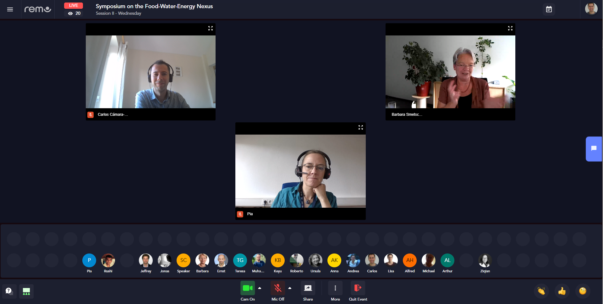
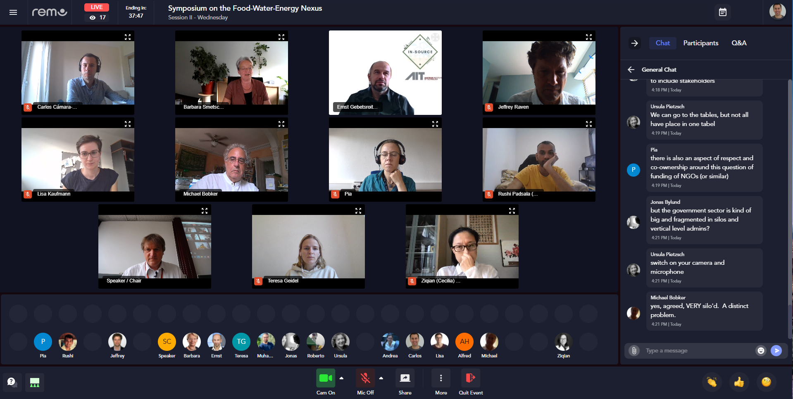

<!-- Add the talk outline, prerequisites, and how people can join. -->

In this talk we present how we have implemented a co-design process with our partners and stakeholders for the creation of "grounded" FEW nexus' visualisations that enforce decision making on FEW nexus.

