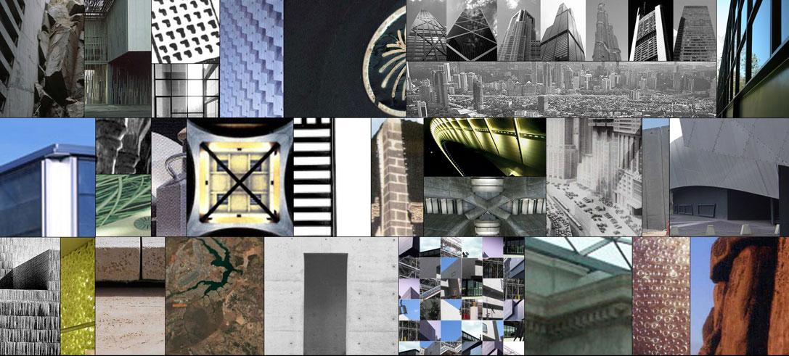

Ayer tomé una decisión dolorosa: cerrar definitivamente la comunidad online que creé en 2004, [+arquitectura]("). Desde ayer, si alguien intenta acceder encontrará una página diciendo que el sitio donde solíamos reunirnos unos cuantos amantes de la arquitectura ya no existe o no está disponible. Es cierto que desde mediados de 2009 [la participación en comunidad había empezado a decrecer notablmente](http://carloscamara.es/blog/2009/11/25/arquitectura-un-ano-despues) y también es cierto que en los últimos dos años apenas ha habido participación alguna (incluso yo mismo dejé de hacerlo), pero no por ello ha sido menos doloroso tomarla. Y es que en el fondo soy consciente de que con el cierre de la web también se produce un cierre de tapa: al fin y al cabo **+arquitectura siempre ha sido para mi algo más que un proyecto, ha sido una experiencia vital**.

¿Por qué, entonces, he decidido cerrar ahora la web? Ya he reconocido que lejos quedaron los tiempos en los que coincidíamos a diario un grupo relativamente numeroso para hablar, discutir y aprender de arquitectura, de Internet, de relaciones humanas[^1]... y de la vida en general. Las numerosas conversaciones y discusiones de los foros en los que todos aprendíamos de todos se iban transformando, poco a poco, en consultas, cada vez más "urgentes" y con menos modales, en las que alguien preguntaba cualquier aspecto, sin importar que ya estuviese respondido anteriormente. Lejos quedaron los buenos momentos alrededor del pseudo-concurso auto-gestionado llamado "El reto"[^2] en el que ganar no solo&nbsp; no implicaba no llevarse premio sino hacer más deberes. Ese no ha sido el motivo. Ni siquiera ha sido por motivos económicos. Ahora que los recortes están a la orden del día en los ámbitos más dispares (investigación, educación, sanidad, transportes...) podría resultar comprensible cerrar el grifo de algo que nunca ha sido económicamente sostenible (Al contrario, los gastos de mantener una web de este tamaño son considerables, especialmente si contamos el tiempo y dedicación que exige actualizar contenido, mantener el software y el servidor a punto, innovar...). Además, no sería la primera vez: ya cerré otro proyecto en el que había depositado tanta energía, esperanzas y dinero: <a href="http://carloscamara.es/portfolio/archtlas">ArchTLAS</a> (y sin embargo no acabo de acostumbrarme a ello).

### ¿Por qué no lo hice antes?

Así pues, si ya no me aportaba la experiencia y el conocimiento que buscaba cuando la creé, si tampoco me aportaba ingresos[^3]... quizá sería más sensato preguntarme por qué no cerré antes la web. En realidad yo mismo me había planteado muchas veces hacerlo, pero me resistía a tirar la toalla, a cerrar una etapa muy buena de mi vida. <strong>Gran parte de lo que soy hoy como profesional (y me atrevería a decir que también como persona), se lo debo a +arquitectura. Y es también gracias a ella que he conocido a mucha gente que hoy tengo la suerte de contar entre mis amigos</strong>. No es de extrañar que cueste tanto pasar página.
En su lugar opté por algo más cobarde pero igualmente pragmático y casi <em>Darwiniano</em>: decidí hacer lo justo para no dejar que muriera, pero no iba a invertir más tiempo en hacer que la web, la comunidad, saliera a flote.&nbsp; Si tenía que sobrevivor sería por sus propios medios. Y si finalmente revivía, yo sería el primero que se alegraría y volvería a sumarme a ella de nuevo, pero tenía claro que no podía dedicar ningún esfuerzo más por tratar de que así fuera: ya había dedicado demasiado esfuerzo, demasiado tiempo y demasiados recursos . Ingenuamente pensaba que en cualquier momento alguno de los miles de visitantes únicos que seguía recibiendo a diario (este es un fenómeno curioso sobre el que me gustaría reflexionar próximamente) daría un paso al frente y produciría que otros más le siguieran. Solo era cuestión de tiempo. Un tiempo que no llegó nunca.
Y finalmente ocurre, como en tantas otras cosas, que es necesaria una gota que colme el vaso. En este caso la gota que ha colmado el vaso han sido los continuados <em>hackeos</em> que ha sufrido la web durante los últimos meses. El pasado 8 de abril de 2012, un antiguo miembro muy activo de +arquitectura, Occidemente, me informó de que ocurrían "cosas raras" cuando se accedía a la web a través del buscador de google. Tras investigar descubrí que alguien había conseguido inyectar una tienda online de medicinas ilegales que aparecía (sustituyendo el contenido original) cuando alguien accedía a +arquitectura a través de buscadores (yo no había detectado nada porque siempre accedo escribiendo la url directamente en el navegador). A pesar de que borré los archivos inyectados tan pronto como los detecté (necesité varias horas para ello), fue cuestión de relativamente poco tiempo que la web fuera hackeada de nuevo siguiendo el mismo procedimiento. Normal si tenemos en cuenta que solo había atacado el síntoma, pero no había solucionado el verdadero problema: un agujero de seguridad en alguno de los módulos obsoletos y desactualizados que utilizaba +arquitectura. Ante esta situación solo podía hacer tres cosas:

1. Seguir poniendo parches, esto es, ir borrando la tienda cada vez que la pusieran.
2. Actualizar las últimas versiones de seguridad de drupal y los módulos utilizados.
3. Cerrar definitivamente +arquitectura.

Descartada rápidamente la opción 1 (los<em> hackers</em> suelen tener mucha más paciencia y perseverancia -no en vano los ataques suelen hacerlos scripts automatizados), solo quedaban dos como posibles, sin embargo, dado que para actualizar los módulos de drupal era necesario dejar de utilizar versión obsoleta y eso significa un trabajo considerable de migración y también implica rehacer de cero el <em>theming</em>, solo me quedaba la opción que he tomado.

### ¿Y ahora qué?

Con este gesto que es más simbólico que real (al fin y al cabo ya había abandonado +arquitectura <em>de facto</em>) cierro una etapa muy feliz y muy enriquecedora de mi vida. Es ciertamente una pena que no siga adelante, pero sería todavía más triste que todo este trabajo, experiencias, conversaciones, fotografías, entrevistas... recopilados durante casi 9 años se perdiesen para siempre. Para evitar que eso ocurra he optado por dos cosas. Por un lado he dejado archivada una copia "congelada" de +arquitectura, aunque solo sea para alimentar la curiosidad de algunos, avivar la nostalgia de otros, o símplemente como ejercicio etnográfico[^4]. Por otro lado iré moviendo algunos contenidos y comentarios de +arquitectura a mi sitio personal. De momento he empezado[^5] con la sección de "<strong><a href="http://carloscamara.es/taxonomy/temas/los-otros-arquitectos">Los otros arquitectos</a></strong>" y "<a href="http://carloscamara.es/taxonomy/temas/los-no-arquitectos"><strong>Los no-arquitectos</strong></a>", y he aprovechado para darle un pequeño cambio estético. Poco a poco iré subiendo el contenido que falta.

<h3><strong>¡Gracias!</strong></h3>

Y para que esta despedida sea completa y justa, solo me queda agradecer su participación y ayuda a todos aquellos que han hecho posible que +arquitectura pueda cumplir casi 9 años, y muy en especial a mi hermano<strong> David</strong>, <strong>Miquel Mayor</strong>, <strong>Emmanuel Francès</strong>, <strong>Hansbrinker</strong>, <strong>Laura Acosta</strong>, <strong>Maaik Hermans</strong>, <strong>Maria del Pilar Menoyo</strong>, <strong>Ivan Fuster</strong>, <strong>Momoluka</strong>, <strong>Sergio Martínez, Álvaro Carnicero</strong>, <strong>Samuel García</strong>,<strong> Javier Sánchez-Matamoros</strong>,<strong> Nosy</strong>, <strong>Carlos Fernández</strong> y <strong>José Romero</strong>. Sin su ayuda, sin su participación, jamás hubiera podido llegar tan lejos ni durante tanto tiempo, y es que +arquitectura también les pertenece.

[^1]: Durante estos años han sido inevitables y repetidas las ocasiones en las que han aparecido <em>Trolls</em> y <em>Hackers</em> y ha sido toda una experiencia y un desafío aprender a tratar con ellos
[^2]: "El reto" (así se llamaba la historia) Consistía en que un usuario publicaba una foto de una parte de una obra y el resto de usuarios tenían que adivinar de qué se trataba a partir de preguntas de tipo sí/no. Quien adivinaba el reto debía publicar información del edificio y preparar el siguiente reto.
[^3]: Esto podría ponerse en duda, pues aunque si bien es cierto que los ingresos directos de la web no han servido ni para pagar gastos de servidores y dominios, no es menos cierto que varios de los trabajos que he realizado han sido gracias a +arquitectura (como Scalae) o a los conocimientos adquiridos gracias a ella (gracias a ella aprendí a usar Drupal, y gracias a saber usar Drupal y a los conocimientos web he conseguido [varios trabajos](/tags/drupal)
[^4]: Quien desee consultar la copia deberá acceder a <a href="http://v3.plusarquitectura.info" class="ext" target="_blank">http://v3.plusarquitectura.info</a> (o <a href="http://v2.plusarquitectura.info" class="ext" target="_blank">http://v2.plusarquitectura.info</a> para ver la versión anterior) y escribir el nombre de la página como usuario y contraseña cuando le aparezca una ventana de login
[^5]: De momento no están todas las entrevistas ni los comentarios, pero iré añadiéndolos poco a poco"</li>
