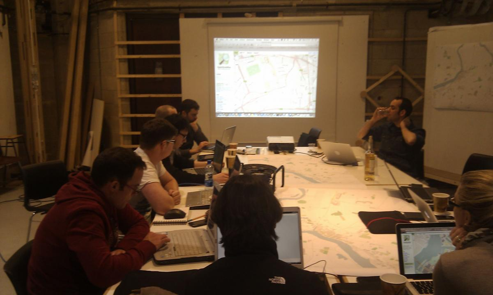

<!-- Tip: open with the why, then show results, code, and next steps. -->



Hace una semana que volví de una breve estancia como profesor invitado en la  [School of Architecture at University of Limerick (SAUL)](http://saul.ie/) gracias al programa erasmus de movilidad para profesores, una escuela que comparte varias similitudes con la [ETSA](http://etsa.usj.es) de la [Universidad San Jorge](http://usj.es), en la que imparto clases actualmente. Durante los cinco días que pude estar allí, tuve la oportunidad de unirme a la asignatura optativa Digital Fabrication asistiendo a los profesores [Javier Buron](http://javierburon.net/) y Michael McLaughlin y los estudiantes Stephen Bourke, Emmanuel Chomarat, David Grace, Weixang Huang, Peter Lawlor y Klest Pango durante el montaje de la cortadora láser [_Lasersaur_](http://labs.nortd.com/lasersaur/). Esta máquina es la más compleja y cara de las que han montado en el [FABLABSaul](https://www.facebook.com/FabLabAtSAUL), y viene después de haber ensamblado exitosamente la máquina de control numérico [Blackfoot CNC Router](http://buildyourcnc.com/blackFoot48v40.aspx) (curso 2011-12) y la impresora 3D [Reprap Pro Mendel](http://reprap.org/wiki/Mendel) (tres semanas antes, [ver vídeo](https://vimeo.com/60248119)), lo cual demuestra que estamos ante un equipo humano muy motivado y con gran experiencia.

Además de mi colaboración en el montaje de la _lasersaur_, pude vivir el día a día de la escuela asistiendo a varias clases como oyente (como el caso de la clase de [clase de tipografía](http://saul.javierburon.net/drawing-representation/typography/) impartida por Javier Buron y otra sobre gobernanza urbana que me pareció sumamente interesante y apropiada pero lamento no haber podido escucharla completamente) e incluso pude participar en el primer mapathon organizado por la escuela, con el objetivo de mejorar la calidad de los mapas y datos de la ciudad de Limerick en [OpenSreetMap.](https://openstreetmap.org)

Si siempre he defendido que todos los alumnos deberían irse de erasmus debido a que se trata de una experiencia sumamente enriquecedora, en esta ocasión tengo que decir que ha sido tanto o más enriquecedora la experiencia como profesor erasmus (aunque muy distintas por razones obvias). Sea como fuera, la experiencia ha resultado muy positiva, no solo por el hecho de participar en actividades tan poco convencionales y excitantes como el montaje de una cortadora láser o contribuir a OpenStreetMap (uno de mis últimos hobbies), sino también (e incluso más importante) porque me ha permitido aprender de otras formas de enseñar arquitectura, que estoy seguro servirán para mejorar mis habilidades como docente y espero que sirvan también para favorecer mobilidad entre ambas instituciones.

Espero que en el futuro próximo pueda repetir experiencias como esta. Para empezar tendremos la suerte de tener a Javier Buron en la ETSA USJ a finales de abril...

