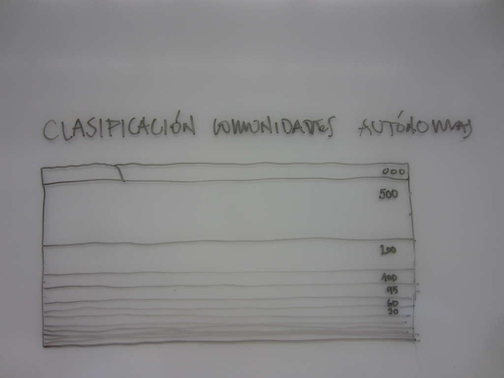
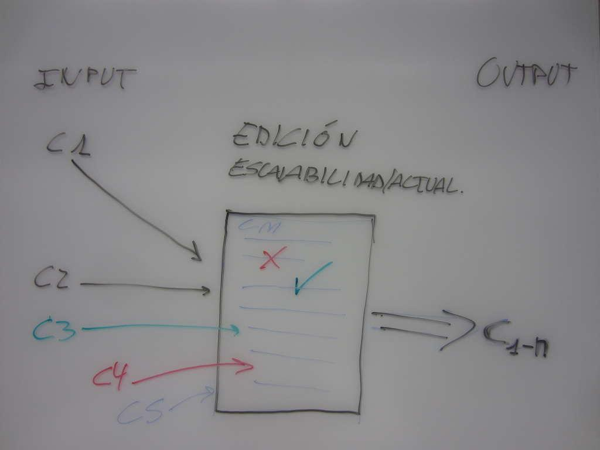

<!-- Tip: open with the why, then show results, code, and next steps. -->

El pasado 11 de noviembre tuve la oportunidad de asistir al <a href="http://cadaveresinmobiliarios.org/hackathon-cadaver/">segundo <em>hackatón</em> de "Cadáveres inmobiliarios"</a>, un evento enmarcado dentro del festival <a href="http://arquinset.org">arquinset</a> y organizado por <a href="http://montera34.com/">Montera34</a>. Para quien no lo conozca, la iniciativa "<a href="http://cadaveresinmobiliarios.org">Cadáveres inmobiliarios</a>" tiene como objetivo la creación de una base de datos colaborativa y exhaustiva de proyectos arquitectónicos y desarrollos urbanísticos inacabados, infrautilizados o vacíos tales como macrourbanizaciones fantasma, edificios públicos abandonados, infraestructuras a medio hacer... que son las consecuencias más claras de la burbuja inmobiliaria que vivió España hasta la primera década del año 2000. Aunque conocía de la existencia desde hacía tiempo (la iniciativa surgió en setiembre de 2014 -ver timeline a continuación), lo cierto es que jamás me había molestado siquiera en saber más sobre ella, y aún menos en participar. Así pues, el <em>hackatón</em> (que viene de hackear y de maratón) más allá de resultar en una experiencia buenísima, me permitió conocer el proyecto en primera persona, e implicarme en un proyecto con el que me siento muy identificado por su temática, por su aproximación abierta y colaborativa y, sobre todo, por la gran cantidad de posibilidades y aplicaciones que ofrece.

<iframe src="//cdn.knightlab.com/libs/timeline3/latest/embed/index.html?source=19gn9eeQckzvUNvslyc_-0EnQOu1yTjleTzf34gRvc3c&amp;font=Default&amp;lang=en&amp;initial_zoom=2&amp;height=650" width="100%" height="650" frameborder="0"></iframe>

Como no podía ser de otra forma, la jornada, perfectamente coordinada por <strong>Pablo Rey</strong> y <strong>Alfonso Sánchez</strong> (a quienes felicito por su trabajo no solo durante el hackatón sino durante los <a href="http://cadaveresinmobiliarios.org/hackathon-cadaver/">reuniones previas</a> y también la <a href="http://cadaveresinmobiliarios.org/tag/hackcadaver/">documentación posterior</a>), empezó la <strong>presentación de cada uno de los asistentes</strong>, en la que contábamos quiénes éramos, por qué estábamos allí y qué podíamos aportar. Viendo que éramos un grupo numeroso y&nbsp; de perfiles muy variados (arquitectos, biólogos, arquitectos técnicos, geógrafos, interioristas, programadores...) todo apuntaba que del hackatón saldría algo interesante, tal y como acabó ocurriendo. Una vez hechas las presentaciones, iniciamos la <strong>fase de brainstorming</strong> en la que, durante un tiempo estipulado, cada uno de los asistentes hacíamos propuestas de actividades que creíamos podían hacerse con la base de datos existente, con la singularidad de que debíamos de ser capaces de resumir la idea con un dibujo, algo que me pareció una idea excelente ya que obliga a poner a prueba tus ideas y a sintentizarlas[^1]. Al finalizar el tiempo iniciamos un turno en el que cada una de las personas <strong>presentábamos nuestra propuesta</strong>, tras lo cual los asistentes decidíamos en cuales nos gustaría trabajar durante el día y nos organizamos en grupos. Esta fue otra decisión que me pareció muy acertada por su pragmatismo: en lugar de votar las propuestas más interesantes y desarrollar entre todos la más votada, cada uno decía dónde le gustaría trabajar durante el día, en función de sus intereses y habilidades por un lado y de la viabilidad de la propuesta por otro. De este modo <strong>se fueron formando grupos de trabajo autónomos</strong> que irían desarrollando en paralelo una de las propuestas.

Al finalizar la jornada se materializaron&nbsp; 4 de las propuestas de visualización de datos:

<ol><li><a href="http://cadaveresinmobiliarios.org/2015/11/11/superficies-cadaver/">Superfícies cadáver</a>: una <a href="http://hackathon.cadaveresinmobiliarios.org/superficie.cadaveres/">visualización interactiva</a> con <a href="https://d3js.org/">D3js</a> que muestra la superfície ocupada por cada uno de los cadáveres de la base de datos.</li><li><a href="http://cadaveresinmobiliarios.org/2015/11/12/juega-a-parodiar-cadaveres/">Juega a "parodiar" cadáveres</a>: una especie de juego consistente en asociar la forma de los distintos cadáveres a alguna imagen de una idea, una película, un objeto, personaje... como un ejemplo de llamar la atención sobre la problemática y como forma de proto-gamificación que podría permitir conocer los distintos cadáveres y rellenar información sobre ellos.</li><li><a href="http://cadaveresinmobiliarios.org/2015/11/12/cadaveres-exquisitos/">Cadáveres exquisitos</a>: un proyecto infográfico que muestra una selección de cadáveres inmobiliarios ordenados por coste y superfície.</li><li><a href="http://cadaveresinmobiliarios.org/2015/11/11/ranking-indicadores-por-comunidades-autonomas/">Ranking-Indicadores por Comunidades Autónomas</a></li></ol>

En lo que a mi respecta, estuve trabajando con <strong><a href="https://twitter.com/montsejoan">Montse</a>, Beatriz Arnaiz, <a href="https://twitter.com/casaspep">Pep Casas</a></strong> y <a href="https://twitter.com/murtr4"><strong>Almudena García</strong> </a>en el grupo <em>"<a href="http://cadaveresinmobiliarios.org/2015/11/11/ranking-indicadores-por-comunidades-autonomas/">Ranking-Indicadores por Comunidades Autónomas</a>"</em> para crear un gráfico que visibilizase el número de cadáveres (el total respecto a los adoptados), los m2 de cadáveres y los diferentes tipos, agrupados por comunidaddes autónomas. Debido al poco tiempo disponible, optamos por una solución de compromiso consistente en crear un google doc en el que importaríamos en tiempo real los datos de la base de datos de cadáveres inmobiliarios (de esta&nbsp; forma siempre tendríamos los datos actualizados) y luego emplearíamos tablas dinámicas para calcular el número de cadáveres por comunidades, o los metros cuadrados por comunidad autónoma. A pesar de todo, la solución empleada permite obtener gráficos dinámicos que se actualizan en tiempo real con los datos de la base de datos de cadáveres inmobiliarios.

<iframe scrolling="no" seamless="" src="https://docs.google.com/spreadsheets/d/1v7cGlf7E1mILUJ13wlxpNJjddIJjFvhE5hj7jBRaiYw/pubchart?oid=55861182&amp;format=interactive" width="645" height="566" frameborder="0"></iframe>

<iframe scrolling="no" seamless="" src="https://docs.google.com/spreadsheets/d/1v7cGlf7E1mILUJ13wlxpNJjddIJjFvhE5hj7jBRaiYw/pubchart?oid=961137301&amp;format=interactive" width="650" height="451" frameborder="0"></iframe>

En lo personal, terminé la jornada con una muy buena sensación (vuelvo a reiterar mi felicitación a todos lo que hicieron el evento posible, en especial a <strong>Montera 34</strong>, al <strong>FAD</strong> y a<strong> Julia Schulz-Dornburg</strong>) y con ganas de seguir trabajando en el proyecto y con los integrantes del mismo y desarrollar alguna de las ideas que quedaron pendientes. Pero de ello ya hablaré próximamente...

Y, para terminar, aquí tenéis un vídeo resumen de la jornada.



[^1]: El listado completo de las ideas propuestas está disponible en <a href="http://cadaveresinmobiliarios.org/2015/11/11/hackcadaver-ideas-de-visualizacion-de-la-base-de-datos/">este post del blog de cadáveres inmobiliarios</a>
